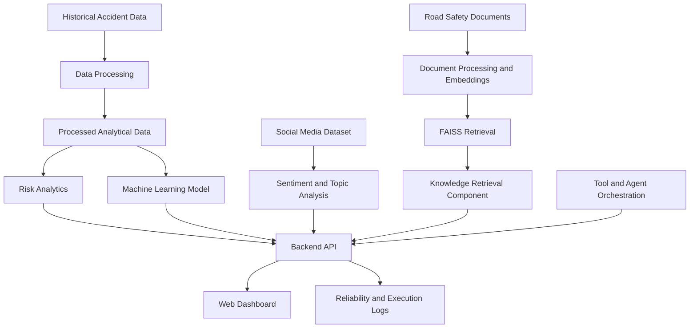

# 🚦 MahaTraffic AI
### A Reliable Multi-Agent Road-Risk Intelligence System Using Big Data, Social Media Analytics, MCP, and Guardrails

MahaTraffic AI is a road-safety intelligence platform designed to analyze historical road accident data, identify district-level risk patterns, analyze social media sentiment, and provide data-driven insights for road-risk assessment in Maharashtra, India.

The project combines data engineering, machine learning, social media analytics, Retrieval-Augmented Generation (RAG), tool-based workflows, and reliability evaluation to explore how AI can support road-safety analysis.

> **Important:** This project analyzes historical accident records and analytical datasets. Its risk scores and model outputs are decision-support estimates, not guarantees of future accidents or a replacement for official traffic and emergency services.

---

## 📌 Table of Contents

- [Overview](#-overview)
- [Objectives](#-objectives)
- [Key Features](#-key-features)
- [System Architecture](#-system-architecture)
- [Technology Stack](#-technology-stack)
- [Machine Learning Pipeline](#-machine-learning-pipeline)
- [RAG and Knowledge Retrieval](#-rag-and-knowledge-retrieval)
- [Project Structure](#-project-structure)
- [Installation and Setup](#-installation-and-setup)
- [Running the Application](#-running-the-application)
- [API Endpoints](#-api-endpoints)
- [Configuration](#-configuration)
- [Testing and Evaluation](#-testing-and-evaluation)
- [Limitations](#-limitations)
- [Future Enhancements](#-future-enhancements)
- [Contributing](#-contributing)
- [Disclaimer](#-disclaimer)

## 🔍 Overview

Road accidents are influenced by multiple factors, including road conditions, environmental conditions, traffic patterns, and human behavior. Analyzing these factors across large historical datasets can help identify patterns and support better road-safety planning.

MahaTraffic AI provides a modular framework for:

- Analyzing historical accident statistics across Maharashtra.
- Comparing accident frequency, fatalities, and injuries across districts.
- Computing composite road-risk scores.
- Applying machine learning to historical risk categories.
- Analyzing social media sentiment and discussion trends.
- Retrieving relevant information from road-safety documents.
- Evaluating system reliability, groundedness, and adversarial-input handling.

## 🎯 Objectives

1. Process and analyze historical road accident datasets using data-engineering techniques.
2. Identify district-level and temporal accident patterns.
3. Build a machine-learning pipeline for historical risk-category classification.
4. Extract sentiment and topic trends from social media datasets.
5. Integrate document retrieval to support evidence-informed responses.
6. Design modular tool interfaces for analytical operations.
7. Evaluate reliability, response grounding, and system behavior under challenging inputs.

## ✨ Key Features

### 1. Historical Accident Analytics

- District-wise accident statistics.
- Year-wise accident trend analysis.
- Fatality and injury comparisons.
- Aggregated analytical summaries.
- Processed data support using structured formats such as Parquet.

### 2. Composite Road-Risk Assessment

The system uses a weighted composite score to combine selected risk factors.

An example of the configured risk formula is:

\[
R = 0.40S + 0.25F + 0.20D + 0.15T
\]

Where:

- \(S\) = severity component
- \(F\) = accident-frequency component
- \(D\) = road-related factor
- \(T\) = time-related factor

The components must be normalized or scaled consistently before combining them. The score is a composite analytical indicator, not a direct count of accidents or deaths.

### 3. Machine Learning

- Random Forest classification for historical risk categories.
- Feature-based analysis of accident records.
- Model evaluation using classification metrics.
- Model persistence for reuse by the application.

Model performance depends on the dataset, target-label construction, feature selection, and evaluation split. Results should not be interpreted as proof of real-world future accident prediction.

### 4. Social Media Analytics

- Sentiment classification of available social media posts.
- Aggregation of sentiment distributions.
- Identification of frequently discussed road-safety topics.
- Exploration of public concerns related to road safety.

Social media analysis reflects the available dataset and may not represent the opinions of the entire population.

### 5. Retrieval-Augmented Generation (RAG)

The RAG component is designed to retrieve relevant passages from a road-safety knowledge base, such as official manuals and guidelines, before generating evidence-informed responses.

Potential workflow:

1. Load available road-safety documents.
2. Extract and split document text into chunks.
3. Generate embeddings.
4. Index embeddings for similarity search.
5. Retrieve relevant passages for a query.
6. Use retrieved evidence to support a response.
7. Preserve source references where supported by the implementation.

The embedding model and FAISS index paths are configurable. RAG functionality requires the corresponding documents, dependencies, and index to be available.

### 6. Modular Agent and Tool Integration

The architecture is designed to support separate analytical capabilities, including:

- Accident statistics retrieval.
- Monthly and yearly trend analysis.
- Composite risk-score calculation.
- Risk-category prediction.
- Sentiment analysis.
- Social trend analysis.
- Road-safety document retrieval.

An agent orchestration layer can coordinate these capabilities. MCP-related functionality depends on the actual tool-server implementation and configuration; protocol compliance should be verified before describing the application as a fully compliant MCP server.

### 7. Reliability and Guardrails

The project includes testing and evaluation of system behavior, including:

- API endpoint validation.
- Input validation and error handling.
- Adversarial-input rejection tests.
- RAG groundedness evaluation.
- Execution tracing and reliability logging.
- Tool-execution timeout and retry configuration.

Evaluation results should be reported alongside the test dataset, sample size, metric definition, and evaluation method.

## 🏗️ System Architecture



The diagram illustrates the intended modular workflow. The availability of each component depends on its implementation, configuration, and required data or model artifacts.

## 🛠️ Technology Stack

| Category | Technologies |
|---|---|
| Programming language | Python |
| Backend | FastAPI, Uvicorn |
| Data processing | Pandas, NumPy |
| Data storage format | Parquet |
| Machine learning | Scikit-learn, Random Forest |
| Vector search | FAISS |
| Embeddings | Sentence Transformers |
| LLM integration | OpenRouter, when configured |
| Database | MongoDB, when configured |
| Big data processing | Apache Spark / PySpark, when configured |
| Frontend | HTML, CSS, JavaScript |
| Testing | Pytest |
| Version control | Git and GitHub |

Some technologies are optional or intended for particular modules. Their presence in the configuration does not imply that every component is required to run the basic application.

## 🤖 Machine Learning Pipeline

The machine-learning workflow consists of the following stages:

1. Load the available accident dataset.
2. Validate and preprocess the records.
3. Construct the input features and historical risk-category labels.
4. Split the data into training and evaluation sets.
5. Train a Random Forest classifier.
6. Evaluate the trained model using suitable classification metrics.
7. Save and load the trained model for inference.
8. Expose predictions through the backend where supported.

Recommended evaluation metrics include:

- Accuracy
- Precision
- Recall
- Macro-F1 score
- Confusion matrix
- Cross-validation results
- Temporal holdout performance, where appropriate

If risk labels are derived from the same accident-severity variables used as model features, performance may be inflated by target construction. A temporal holdout and leakage analysis are important before making predictive claims.

## 📚 RAG and Knowledge Retrieval

The document-retrieval component can be used to support road-safety queries with relevant passages from a configured knowledge base.

Example query:

> What road-safety measures are recommended for reducing accident risk at high-risk intersections?

The retrieval pipeline should identify relevant documents and use their contents to support the response. Responses should distinguish retrieved evidence from model-generated interpretation.

Before running the RAG module, verify that:

- The required road-safety documents exist.
- The configured embedding model can be loaded.
- The FAISS index exists or can be generated.
- Document metadata and source references are available.
- Required Python packages are installed.

## 📁 Project Structure

The following is a representative structure. Keep it synchronized with the actual files in the repository.

```text
MahaTrafficAI/
├── backend/
│   └── app/
│       └── main.py
├── frontend/
│   └── index.html
├── data/
│   └── processed/
│       └── parquet/
├── ml/
│   └── models/
├── rag/
│   ├── documents/
│   └── index/
├── reliability/
│   └── logs/
├── tests/
│   └── backend/
├── docs/
├── .env.example
├── .gitignore
├── requirements.txt
└── README.md
```

Large datasets, trained model files, vector indexes, local logs, and secrets may be excluded from Git. If required artifacts are not committed, document how to obtain or regenerate them before running the corresponding module.

## ⚙️ Installation and Setup

### Prerequisites

Install or prepare:

- Python 3.11
- Git
- A compatible web browser
- Optional services: MongoDB, an OpenRouter API key, and Spark, if the selected modules require them

### 1. Clone the repository

```bash
git clone https://github.com/Akansha1425/MahaTrafficAI.git
cd MahaTrafficAI
```

### 2. Create a virtual environment

**Windows PowerShell:**

```powershell
py -3.11 -m venv .venv
.\.venv\Scripts\Activate.ps1
```

If PowerShell blocks environment activation, use Command Prompt:

```cmd
.venv\Scripts\activate.bat
```

### 3. Install dependencies

```bash
python -m pip install --upgrade pip
pip install -r requirements.txt
```

If `requirements.txt` is missing or incomplete, create or update it from the dependencies actually used by the project.

### 4. Configure environment variables

Copy the example configuration:

```powershell
Copy-Item .env.example .env
```

Edit `.env` and provide the values required by the modules you intend to run.

For example:

```dotenv
ENVIRONMENT=development
DEBUG=True
OPENROUTER_API_KEY=
OPENROUTER_BASE_URL=https://openrouter.ai/api/v1
MONGODB_URI=mongodb://localhost:27017
MONGODB_DATABASE=mahatraffic_ai
```

Keep actual credentials in `.env`. Commit `.env.example` with placeholder values, never with real secrets.

### 5. Prepare data and model artifacts

Before starting the complete application, verify that the required datasets, trained model, document collection, and vector index are present.

The exact preprocessing and training commands depend on the scripts included in the repository. Do not assume ignored datasets or model files will be available after cloning.

## ▶️ Running the Application

### 1. Start the backend

From the repository root, activate the virtual environment and run:

```powershell
python -m uvicorn backend.app.main:app --host 127.0.0.1 --port 8081
```

If your application uses a different module path or port configuration, use the corresponding command from your code.

### 2. Verify the backend

Open these URLs in your browser:

- Health check: `http://127.0.0.1:8081/health`
- API documentation: `http://127.0.0.1:8081/docs`

The health-check route is available only if it is implemented in your current backend. If it returns 404, inspect the registered routes in `backend/app/main.py`.

### 3. Start the frontend

In a **second terminal**, navigate to the repository root and run:

```powershell
python -m http.server 5500 --directory frontend
```

Then open:

`http://127.0.0.1:5500`

If port 5500 is unavailable, choose an available local port. This command serves the standalone HTML frontend; it does not start a Vite application.

Ensure the frontend's API base URL points to the running backend, for example:

```javascript
const API_BASE = "http://127.0.0.1:8081";
```

Use the actual API base configuration already present in your frontend.

## 🔌 API Endpoints

The backend uses a versioned API prefix configured as `/api/v1`. Endpoint availability depends on the routes registered in the current application.

| Endpoint | Purpose |
|---|---|
| `/health` | Backend health check, if implemented |
| `/docs` | Interactive FastAPI documentation |
| `/api/v1/dashboard/overview` | Dashboard summary and aggregate statistics |
| District statistics route | District-level accident analysis, if registered |
| Monthly statistics route | Monthly accident analysis, if registered |
| Yearly statistics route | Yearly accident trends, if registered |
| Risk prediction route | Risk-category inference, if registered |
| Sentiment analysis route | Social media sentiment analysis, if registered |
| Road-safety search route | Knowledge retrieval, if registered |

To inspect the exact routes supported by your running version, open:

`http://127.0.0.1:8081/docs`

## 🔐 Configuration

The `.env.example` file provides the following configurable categories:

| Variable | Purpose |
|---|---|
| `ENVIRONMENT` | Application environment |
| `DEBUG` | Debug-mode setting |
| `OPENROUTER_API_KEY` | Credential for configured LLM features |
| `OPENROUTER_BASE_URL` | OpenRouter API base URL |
| `LLM_MODEL` | Configured language model identifier |
| `MONGODB_URI` | MongoDB connection string |
| `MONGODB_DATABASE` | Database name |
| `EMBEDDING_MODEL` | Embedding model used by retrieval |
| `FAISS_INDEX_PATH` | Vector index location |
| `DOCUMENTS_PATH` | Road-safety document directory |
| `MCP_SERVER_HOST` | Configured tool-server host |
| `MCP_SERVER_PORT` | Configured tool-server port |
| `PARQUET_DATA_PATH` | Processed dataset location |
| `ML_MODEL_PATH` | Trained model location |
| `RELIABILITY_LOGS_PATH` | Reliability log directory |

Ensure the configured paths match the actual project files. Environment variables must also be loaded by the application code to take effect.

## 🧪 Testing and Evaluation

Run the project's test suite from the repository root:

```powershell
python -m pytest -q
```

If a project-level validation script exists, run it using its documented command. For example, use `python run_all.py` only if that file exists in the repository.

Evaluation should cover:

- Backend endpoint behavior.
- Data processing and risk-score calculations.
- Model performance and possible feature leakage.
- Retrieval relevance and groundedness.
- Input validation and guardrail behavior.
- Failure handling and execution timeouts.

When publishing results, include the dataset version, evaluation method, number of test cases, and metric definitions. Do not treat a successful unit-test suite as proof of real-world road-safety accuracy.

## ⚠️ Limitations

- Historical accident records may contain missing values, reporting biases, or inconsistent data.
- Composite risk scores depend on the selected weights and input normalization.
- Machine-learning performance depends on label quality and evaluation methodology.
- Social media sentiment may not represent the general population.
- RAG responses can be incomplete or unsupported if relevant documents are missing.
- External LLM services may require valid API credentials and can be subject to rate limits or usage charges.
- MongoDB, Spark, and MCP-related services may require additional setup when enabled.
- This system is not a live traffic monitoring service unless integrated with verified real-time data sources.

## 🚀 Future Enhancements

- Integrate verified real-time traffic and road-condition data.
- Expand accident datasets and evaluate performance across time periods.
- Add explainable ML methods for understanding risk factors.
- Improve retrieval quality using hybrid search and reranking.
- Expand multilingual road-safety assistance.
- Add stronger source attribution and hallucination checks.
- Integrate operational monitoring and structured audit trails.
- Evaluate tool orchestration against a clearly defined MCP implementation.
- Develop a deployment-ready dashboard with authentication and access controls.

## 🤝 Contributing

Contributions are welcome.

1. Fork the repository.
2. Create a feature branch.
3. Implement and test your changes.
4. Commit your changes with a clear message.
5. Open a pull request describing the changes.

Please do not commit API keys, credentials, private datasets, or other sensitive information.

## 📄 Disclaimer

MahaTraffic AI is an academic and engineering project intended for research, experimentation, and decision-support exploration. Its outputs should not be used as the sole basis for emergency response, road closures, law-enforcement decisions, or other safety-critical actions.

Always consult official road-safety authorities and verified sources for operational decisions.

---

**Developed as a road-safety analytics and AI research project.**

Repository: [Akansha1425/MahaTrafficAI](https://github.com/Akansha1425/MahaTrafficAI)
