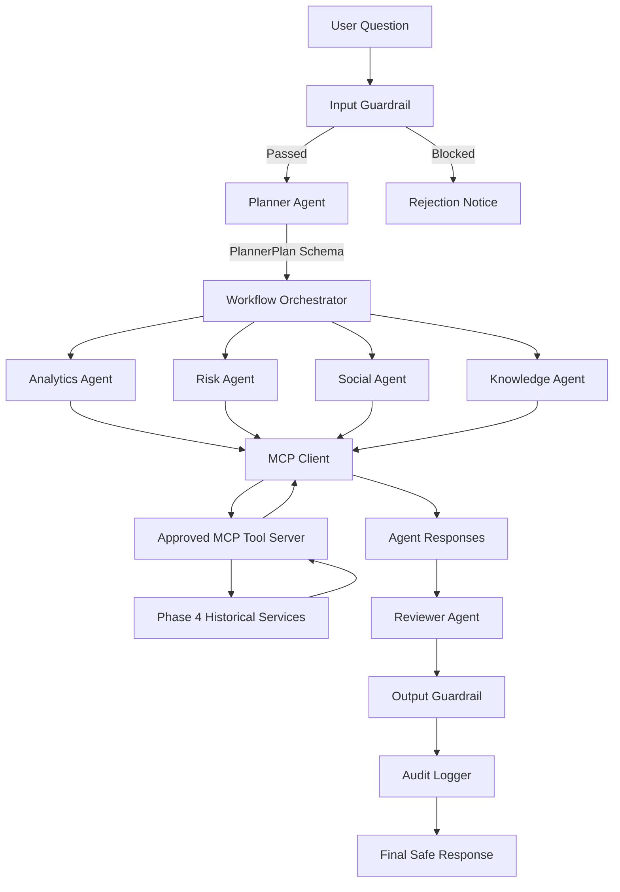

# MahaTraffic AI — Multi-Agent Architecture Design

## 1. Executive Summary

MahaTraffic AI employs a modular, deterministic, multi-agent architecture to deliver factual, reliable road-safety analytics for Maharashtra. The system orchestrates specialized agents using Model Context Protocol (MCP) tool interfaces, input/output guardrails, and automated verification without reliance on opaque or non-deterministic external LLMs.

---

## 2. Multi-Agent Pipeline Flow

The execution workflow follows a strict sequential-and-parallel orchestration pipeline:

---

## 3. Agent Roles & Specifications

### 3.1 PlannerAgent
- **Responsibility**: Interprets user intent, extracts geographical entities (districts like Pune, Mumbai) and road types, and produces a validated `PlannerPlan`.
- **Constraint**: The Planner *never* directly executes tools or returns final user answers.
- **Routing**: Activates only specialist agents relevant to the query to avoid wasted computation.

### 3.2 AnalyticsAgent
- **Responsibility**: Historical accident frequency, fatality trends, and monsoon seasonality analytics.
- **Tools Invoked**: `get_city_accident_statistics`, `get_monthly_accident_statistics`.
- **Data Source**: Official Maharashtra historical accident dataset (2019–2023).

### 3.3 RiskAgent
- **Responsibility**: Computes composite formula-based risk indices and Random Forest ML risk classification tiers.
- **Tools Invoked**: `calculate_risk_score`, `predict_risk`.
- **Validation**: Enforces risk score range [0.0, 100.0] and tier categorization (`LOW`, `MEDIUM`, `HIGH`).

### 3.4 SocialAgent
- **Responsibility**: Citizen perception analysis, recurring road condition grievances (potholes, waterlogging), and sentiment distribution.
- **Tools Invoked**: `analyze_sentiment`, `get_social_trends`.
- **Critical Policy**: Explicitly labels social sentiment as citizen perception/grievance signals and enforces non-causal reporting.

### 3.5 KnowledgeAgent
- **Responsibility**: Contextual grounding from indexed official road safety guidelines (MoRTH 2022, Maharashtra Motor Vehicles Rules, IRC SP:88).
- **Tools Invoked**: `search_road_safety_documents`.
- **Grounding**: Returns exact citations and similarity relevance scores.

### 3.6 ReviewerAgent
- **Responsibility**: Verifies factual grounding of claims against retrieved MCP tool payloads, checks risk score bounds, ensures transparent disclosure of missing district records, confirms non-causal social reporting, and produces a validated `ReviewResult`.
- **Limitation Statement**: Explicitly acknowledges that automated reviewers cannot guarantee the complete absence of hallucinations.

---

## 4. Structured Data Contracts (Pydantic)

All agent communication utilizes strict Pydantic models defined in `agents/schemas.py`:
- `PlannerPlan`: Intent, required agents, planned tools, target entities, and reasoning.
- `ToolRequest`: Target tool name, parameters, execution timeout, and caller identifier.
- `ToolResponse`: Status (`success`, `error`, `fallback`), structured payload, error string, latency, and retry count.
- `AgentResponse`: Agent identifier, summary, structured data, tools called, and execution latency.
- `ReviewResult`: Safety approval boolean, hallucination risk evaluation, grounding verification, and warnings.
- `WorkflowResult`: Full end-to-end trace with unique run ID, plan, agent outputs, review results, and latency.
